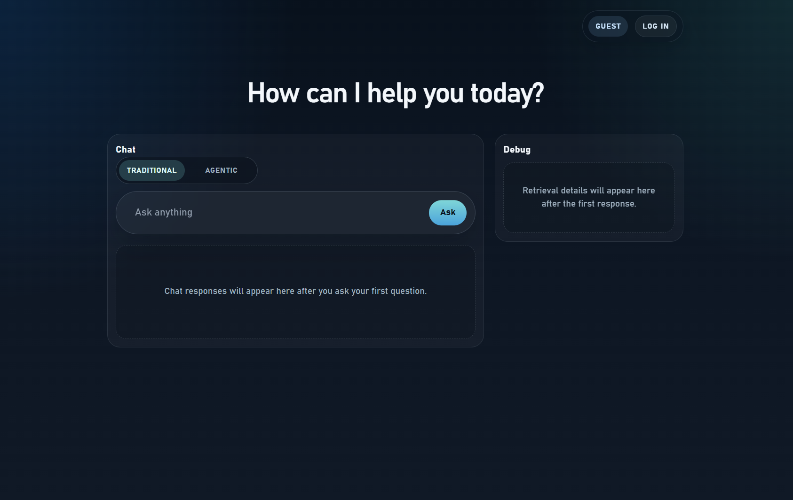

# Azure AI Search Demo Script: Traditional vs Agentic Retrieval

## Objective
Show how Azure AI Search supports a telecom-style experience where public product discovery is open to everyone, but detailed manuals, specifications, and deployment guidance are only available to authenticated users.

## Demo UI Snapshot

---

# 1. Framing (30 sec)

**Say:**

> What you are about to see is a product search and support experience, not just a chatbot.
> The answer changes based on who you are and how retrieval is performed.

> Same question. Different answers. Two different retrieval models.

---

# 2. Establish Trust (Security Trimming) (1-2 min)

**Action:**
Ask:

> What can you tell me about Aurora RAN 6651?

Run as:

* Guest
* Authenticated user

**Say:**

> Notice how the answers differ. That is not the model behaving differently. It is retrieval.

> The guest can see public product positioning and solution summaries.
> The authenticated user can also see protected detail sheets and manuals.

> We use Azure AI Search security trimming, which means access control is enforced at query time before the model sees any protected content.

---

# 3. Show the Machinery (Traditional Retrieval) (1 min)

**Action:**
Show logs / retrieval panel:

* Query
* Selected index and source set
* Authorization pass-through header

**Say:**

> This is traditional retrieval using Azure AI Search.

> In this mode we explicitly choose how retrieval is done:
>
> * Which index to search
> * What query to send
> * Which user context to pass through for ACL enforcement

> In this demo, that means we are doing application-controlled retrieval over indexed Ericsson-style content.

> This gives us full control, but it also means we own the retrieval logic.

---

# 4. Introduce Tension (20 sec)

**Say:**

> This works well, but it means we are responsible for designing the full retrieval path.

> So what happens if we don’t?

---

# 5. Switch to Agentic Retrieval (Knowledge Base) (2 min)

**Action:**
Switch mode → `Agentic`

Ask the SAME question again.

**Show logs / panel:**

* Platform-managed retrieve call
* Knowledge base call

**Say:**

> Now we are using Azure AI Search Knowledge Base as the retrieval layer.

> Notice what changed:
>
> * We are no longer hand-crafting the retrieval flow
> * The platform is assembling the retrieval plan for us

> The platform now handles:
>
> * Query rewriting
> * Chunking
> * Ranking

> We have moved from query design to knowledge design.

---

# 6. Aha Moment (Reasoning over Retrieval) (1-2 min)

**Action:**
Ask:

> Compare Aurora RAN 6651 and Nimbus Indoor 2400 for a factory deployment.

**Say:**

> This is where the value becomes obvious.

> This is not just one lookup anymore. The system needs to combine public product positioning with protected planning content.

> Azure AI Search is no longer just returning documents. It is supporting LLM-driven reasoning over retrieved knowledge.

---

# 7. Failure Mode (Grounded Answers) (30 sec)

**Action:**
Ask:

> Which product manual covers lunar mining networks?

**Say:**

> The system returns no answer.

> That is because we enforce grounded retrieval. The model can only answer from retrieved content.

> No data → no answer → no hallucination.

---

# 8. Close (30 sec)

**Say:**

> Azure AI Search gives us:
>
> * Enterprise-safe retrieval with security trimming
> * Deterministic retrieval when we want full control

> And now:
>
> * A knowledge layer that reduces retrieval orchestration for AI systems

> The important point is that the same content universe can support public discovery, protected technical detail, and agentic retrieval.

---

# Feature Mapping Table (for reinforcement)

| Demo step          | What you showed                 | Azure AI Search feature                               | Why it matters in this demo                           |
| ------------------ | ------------------------------- | ----------------------------------------------------- | ----------------------------------------------------- |
| Guest vs Auth      | Same prompt, different answers  | Security trimming (`x-ms-query-source-authorization`) | Enterprise-safe retrieval before the LLM sees data    |
| Traditional mode   | Visible query logic             | Application-controlled retrieval                      | Deterministic and debuggable retrieval behavior       |
| Local citations    | Clickable source documents      | Grounded retrieval with source attribution            | Trust, auditability, and easy answer validation       |
| Agentic mode       | One retrieve call               | Knowledge Base                                        | Less custom retrieval orchestration to maintain       |
| Complex question   | Product comparison across docs  | Multi-step retrieval over indexed knowledge           | Better fit for AI assistants, not just search boxes   |
| Failure case       | “I don’t know”                  | Grounded answer behavior                              | Lower hallucination risk                              |
| Public vs protected | One experience, two content planes | Public index plus protected index                  | Mirrors real product and support portal journeys      |

---

# Key takeaway

> Azure AI Search is not just a search engine.
> It is a retrieval system that can power both product discovery and protected technical assistance.

> You can control retrieval directly, or let the platform orchestrate more of it for you.

---
